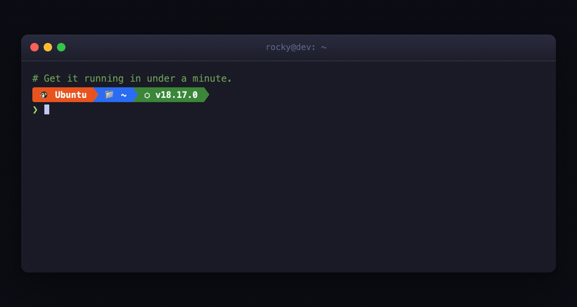

# &lt;x-zsh&gt;

**Drop-in animated terminal walkthroughs as an HTML element.** Write a terminal session
in plain text and `x-zsh` renders an animated, Powerlevel10k-style zsh — typing,
spinners, progress bars — fully isolated in its own Shadow DOM.

It's a *walkthrough player*, not an emulator: you can't type into it, and there's no
backend. Perfect for docs, READMEs-as-pages, landing pages, and install guides.

<p align="center">
  
</p>

- 🪶 One `<script>`, zero config, no build, no dependencies (~10 KB)
- 🛡️ Self-isolated in Shadow DOM — styles can't leak in or out
- ⌨️ Human-feeling typing (jitter + a blink at the prompt before each command)
- 📊 Authentic spinners and five real progress-bar styles (pip, wget, curl, cargo, tqdm)
- ⏯️ Optional controls (step / play-pause / replay) and infinite looping
- 🎨 Themeable via CSS custom properties; light & dark built in
- ♿ Respects `prefers-reduced-motion`

> **Live docs & examples:** https://i-rocky.github.io/x-zsh/

---

## Install

### CDN

```html
<!-- unpkg, latest -->
<script src="https://unpkg.com/x-zsh"></script>

<!-- or jsDelivr, pinned -->
<script src="https://cdn.jsdelivr.net/npm/x-zsh@0.1.0/x-zsh.js"></script>
```

### npm

```sh
npm install x-zsh
```

```js
import 'x-zsh'; // side-effect import registers the <x-zsh> element
```

The script auto-registers `<x-zsh>` on load — there is nothing to initialize.

> A standards custom-element name must contain a hyphen, so the tag is `<x-zsh>`
> (not `<shell>`). Register a different tag with `XZsh.register('my-term')`.

---

## Quick start

```html
<x-zsh os="ubuntu" plugins="node" height="260" controls>
  note: Spin up the project locally.
  cmd: git clone https://github.com/acme/widget.git
  Cloning into 'widget'...
  spinner[2s]: Receiving objects => Received 2,418 objects, done.
  cmd: cd widget && npm install
  progress[2.4s]: Installing dependencies
  success: added 219 packages in 2s
  cmd: npm run dev
  info: ➜  Local:   http://localhost:5173/
</x-zsh>
```

---

## The language

The content between the tags is a tiny line-based language. **A bare line is stdout** of
the command above it; you only reach for a verb when a line isn't plain output. Only the
reserved words below (lowercase, followed by `:`) are verbs — any other `word:` renders as
ordinary output, so there's nothing to escape. Indentation is stripped.

### Input

| Verb | Meaning |
|---|---|
| `cmd:` | The user types a command (prompt + typing animation). |
| `root:` | A command needing root — rendered as `sudo <command>` on the normal prompt. |
| `type:` | A typed response; appends inline to the previous line (e.g. answering `[Y/n]`). |
| `key:` | A keypress glyph — `key: ^C`, `key: enter`, `key: tab`. |

### Output

| Verb | Meaning |
|---|---|
| *(bare line)* | Standard output. |
| `warning:` | Yellow. |
| `error:` | Red. |
| `success:` | Green. |
| `info:` | Cyan. |
| `note:` | An author's aside, rendered as a dimmed shell comment (`# text`). |

### Time & effects

| Verb | Meaning |
|---|---|
| `delay[800]:` | Pause; renders nothing. |
| `spinner[2s]: label => done` | Spinner for the duration, then `✓ done` (`=> done` optional). |
| `progress[3s]: label` | Progress bar 0→100% over the duration. |

### Screen & context

| Verb | Meaning |
|---|---|
| `clear:` | Clear the screen. |
| `prompt: dir=… branch=…` | Change prompt context — keys `user host dir branch git`. |
| `# …` | A source comment; never renders. |

**Auto-tracked (no verb):** `cd app` (incl. `&&` chains) updates the directory segment;
`git init`/`git clone` reveals the branch segment; `git checkout -b dev` switches it.

### Durations & styles

The bracket on timed verbs holds a **duration** and/or a **style**, in any order:
`progress[3s pip]`, `spinner[1.5s line]`. Durations accept `800` (ms), `800ms`, `2s`, `1.5s`.

- **Progress styles:** `block` (default, tqdm/pip), `pip` (rich), `wget`, `curl`, `arrow` (cargo).
- **Spinner styles:** `dots` (default), `line`, `bar`, `arc`, `circle`.

---

## Attributes

All optional, set on the `<x-zsh>` tag.

| Attribute | Default | What it does |
|---|---|---|
| `os` | `ubuntu` | Prompt icon + color: `ubuntu, debian, macos, arch, fedora, alpine`. |
| `mode` | `dark` | `dark` or `light`. |
| `plugins` | — | Comma list of prompt segments: `node, python, docker, rust, go`. |
| `user` `host` `dir` `branch` | `you localhost ~ main` | Initial prompt context. |
| `title` | `user@host: dir` | Window title-bar text. |
| `height` | — | Fixed screen height (px number or CSS length). Scrolls internally; auto-scrolls. |
| `rows` | — | Fixed height in text rows (overrides `height`). |
| `speed` | `34` | Average ms per typed character. |
| `gap` | `900` | ms the prompt blinks before a command starts typing. |
| `bar` | `block` | Default progress-bar style. |
| `controls` | off | Show the step / play-pause / replay bar. |
| `loop` | off | Replay forever. |
| `loop-delay` | `1400` | ms between loops. |

It plays when scrolled into view.

---

## Theming

Every color is a CSS custom property on the host:

```css
x-zsh {
  --bg: #1e1e2e;
  --fg: #cdd6f4;
  --accent2: #89b4fa; /* prompt / spinner accent */
}
x-zsh::part(window) { border-radius: 6px; }
```

`mode="light"` ships a light palette. A named-theme registry hook exists for the future:
`XZsh.theme('name', { … })`.

---

## Browser support

Any browser with Custom Elements v1 and Shadow DOM v1 (all current evergreen browsers).
Box-drawing/powerline separators are drawn with CSS, so no special fonts are required.

---

## Development

See [CONTRIBUTING.md](CONTRIBUTING.md). In short: it's one dependency-free file
(`x-zsh.js`) and a static docs page (`index.html`).

```sh
git clone https://github.com/i-rocky/x-zsh
cd x-zsh
npm start          # serves the docs at http://localhost:8000
```

## License

[MIT](LICENSE)
